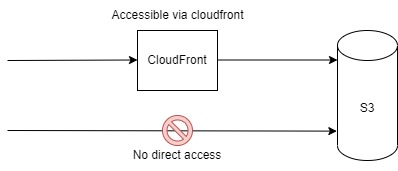

# S3-Cloudfront CloudFormation Template
* Diagram

  

* This is a CloudFormation template to create a S3 bucket and CloudFront distribution.
* Access files stored in S3 via CloudFront.

## S3 Bucket delete
* For Amazon S3 buckets, all objects in the bucket must be deleted for the deletion to succeed.

## S3 Access Keys
* S3 access keys are created from the AWS console. However, if you use the Secret Manager, you can create them in cloudformation.